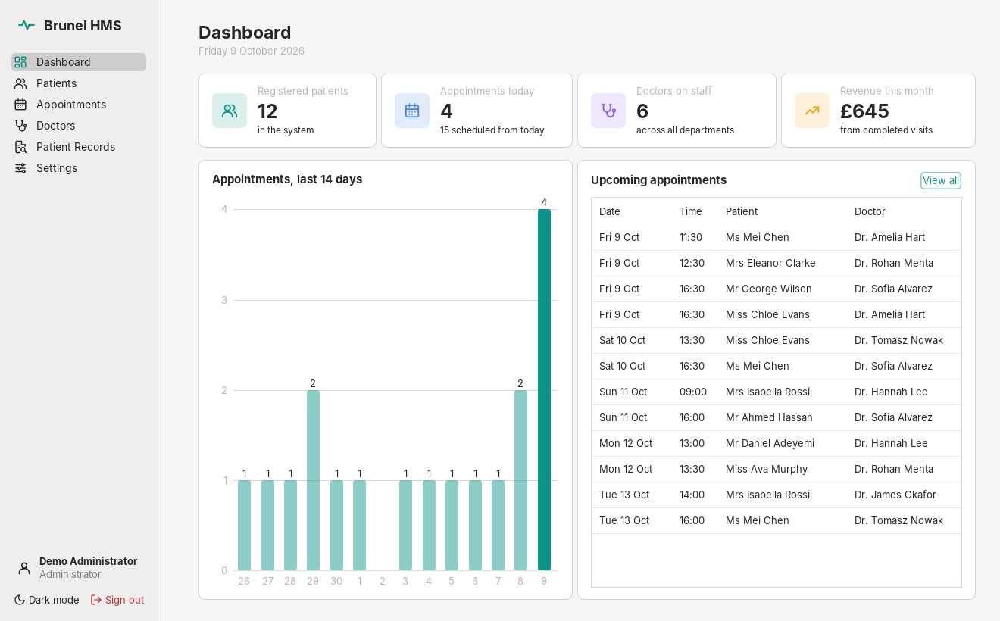
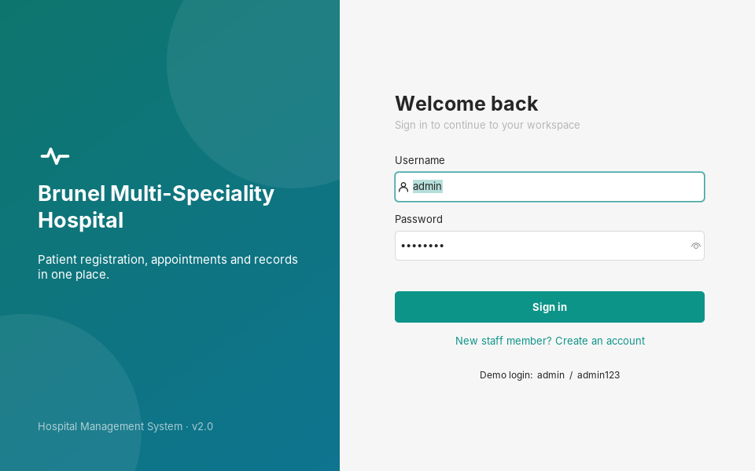
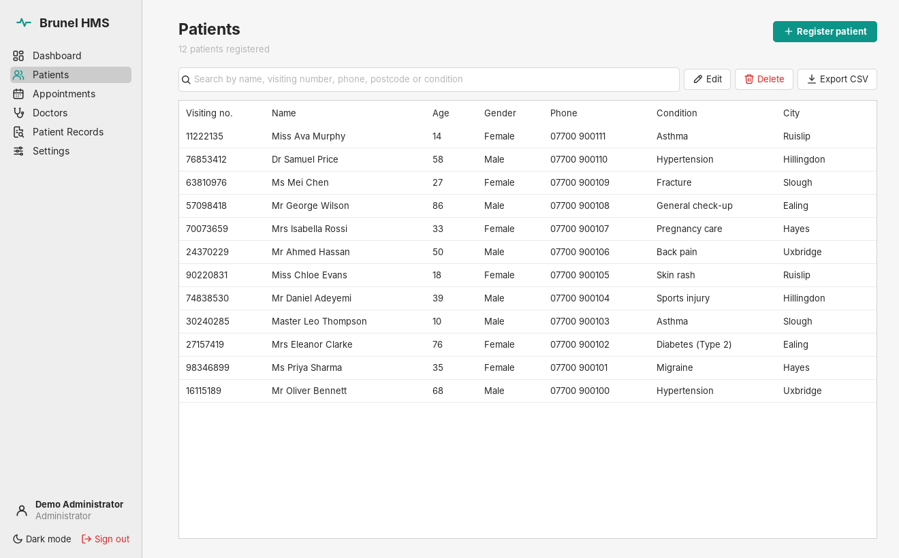
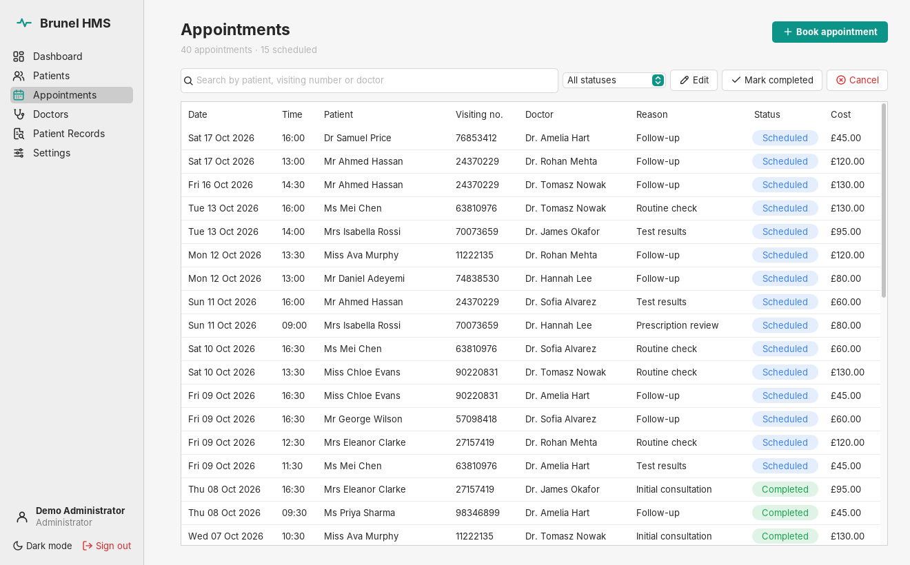
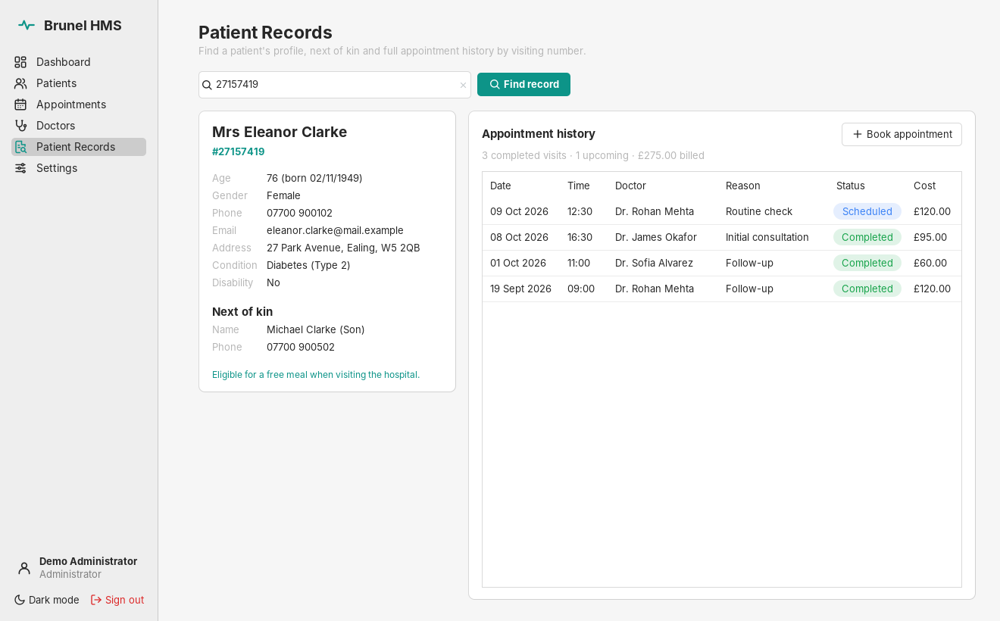
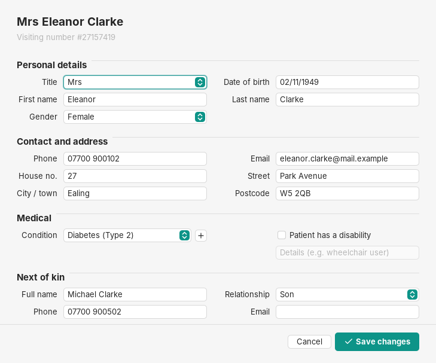
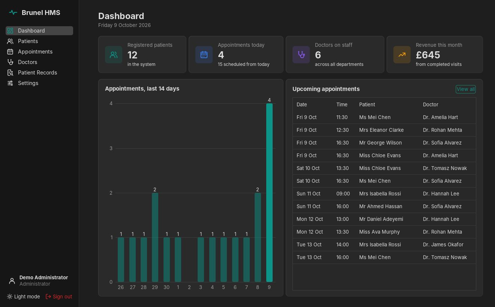

# Hospital Management System

A desktop app for hospital reception staff, built with **Java Swing** and **SQLite**. Staff sign in, register patients and their next of kin, book appointments with doctors, and look up a patient's full history by visiting number. A dashboard shows the day at a glance.



## Features

- **Secure sign-in.** Staff accounts with salted PBKDF2 password hashing, plus a self-service "create account" screen.
- **Dashboard.** Live counts of patients, today's appointments, doctors and this month's revenue, a 14-day appointment chart, and the next upcoming appointments.
- **Patient registration.** Validated form (names, UK postcode, phone, email, real dates of birth). Each patient gets a unique 8-digit visiting number, with next-of-kin details stored alongside.
- **Instant search** across name, visiting number, phone, postcode and condition, with **CSV export**.
- **Appointments.** Book, edit, complete or cancel appointments. Fees fill in automatically from the doctor's rate, and a doctor can't be double-booked for the same slot.
- **Doctors.** Manage staff, specialties and consultation fees.
- **Patient records.** Enter a visiting number to see the patient's profile, next of kin, age-based care notice and full appointment history, with totals.
- **Settings.** Manage the list of medical conditions.
- **Light and dark themes.** Your choice is remembered between runs.

| Login | Patients |
|---|---|
|  |  |
| **Appointments** | **Patient record** |
|  |  |
| **Register / edit patient** | **Dark mode** |
|  |  |

## Tech stack

| Area | Choice |
|---|---|
| Language | Java 17 |
| UI | Swing with [FlatLaf](https://www.formdev.com/flatlaf/) (modern light/dark look) and MigLayout |
| Database | SQLite via `sqlite-jdbc`; schema in [`schema.sql`](src/main/resources/com/hms/db/schema.sql) |
| Build | Maven, packaged as one runnable jar |
| Tests | JUnit 5 (validation, password hashing, data access against a temporary database) |

## Getting started

You need **JDK 17 or newer** and **Maven**.

```bash
git clone <this repo>
cd hospital-management
mvn package
java -jar target/hospital-management.jar
```

On first launch the app creates `data/hospital.db` next to where you run it and fills it with sample doctors, patients and appointments.

**Demo login:** `admin` / `admin123`

Other useful commands:

```bash
mvn test          # run the test suite
mvn compile exec:java   # run without building the jar
```

To use a different database file, set the `HMS_DB` environment variable, for example `HMS_DB=/path/to/clinic.db`.

## Project structure

```
src/main/java/com/hms
├── App.java                 entry point
├── Services.java            shared data-access objects
├── db/                      connection, schema setup, demo data
├── dao/                     SQL for users, patients, doctors, appointments, conditions
├── model/                   immutable records (Patient, Appointment, ...)
├── util/                    input validation, password hashing
└── ui/                      login, main window, pages, dialogs, reusable components
```

## How it evolved

Version 1 was a university group project at Brunel: seven separate Swing windows built with Eclipse WindowBuilder. You can see it in the first commit. Version 2 is a rewrite that keeps the original ideas, including visiting numbers, the age-based notices and the "previous record" lookup, and fixes what held it back:

| Version 1 | Version 2 |
|---|---|
| Database and image paths hard-coded to one Windows PC | One database created automatically next to the app |
| Four separate `.db` files, no schema in the repo | One normalised schema with foreign keys |
| Passwords stored and shown in plain text | Salted PBKDF2 hashes, masked password field |
| Missing "new user" screen, so it didn't compile | Working registration dialog |
| Closing any window quit the app | One main window with sidebar navigation |
| "Previous record" asked for appointment data nothing saved | Real appointments linked to patients and doctors |
| Age notice for under-13s could never show | Fixed, and covered by a test |
| No build tool or tests | Maven build, runnable jar, 15 JUnit tests |
